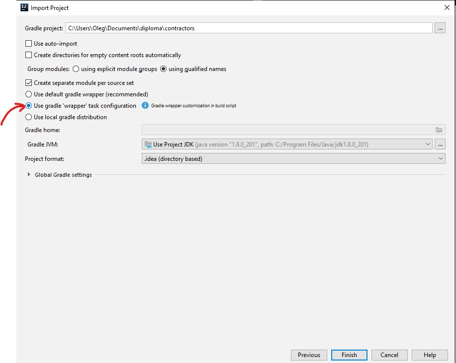
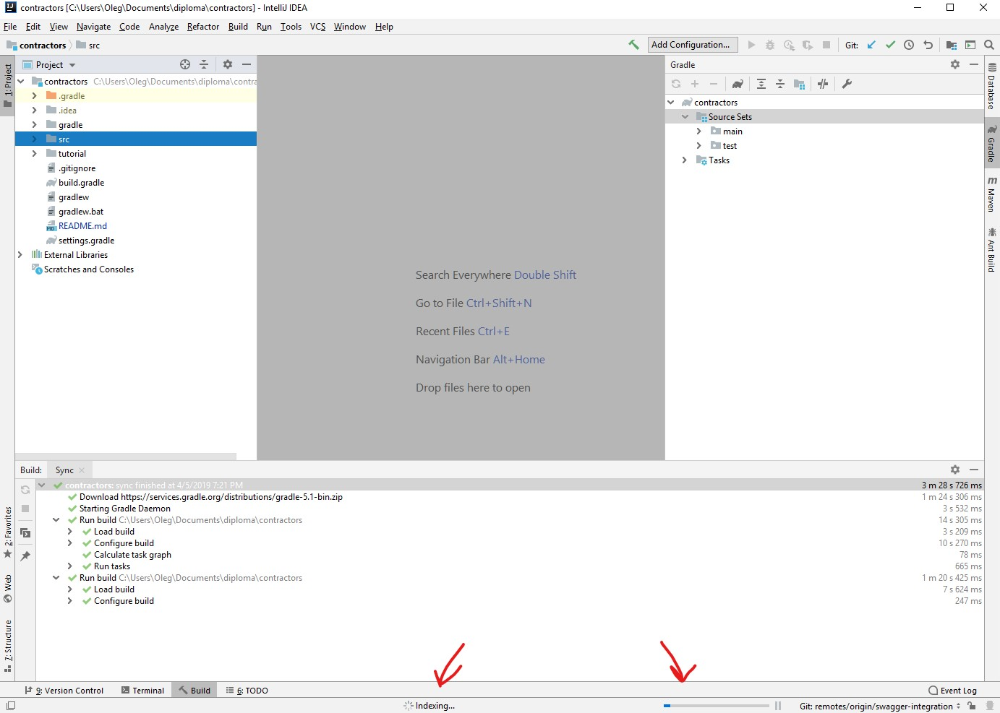
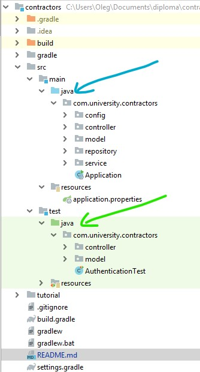
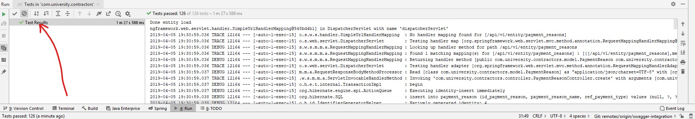

# Contract Students Management Service

### REST API endpoints:

// todo: add endpoints list

### How to start database server with Docker
##### Steps for macOS/Ubuntu
1. Setup docker([macOS](https://docs.docker.com/docker-for-mac/install) / [Ubuntu](https://docs.docker.com/install/linux/docker-ce/ubuntu/))
2. Pull image with database by executing following command:
    ```
    docker pull olegbarmin/diploma:DEVELOPMENT
    ```
3. Find ID of downloaded image by executing:
    ```
    docker image ls
    ```
4. Run a container from the image on 1433 port.
    ```
    docker run  -p 1433:1433 <IMAGE_ID>
    ```

### How to setup development environment
#### Prerequriments:
- Git (https://www.atlassian.com/git/tutorials/install-git#windows)
- JDK 1.8 or higher (https://www.oracle.com/technetwork/java/javase/downloads/jdk8-downloads-2133151.html)
- IntelliJ IDEA (https://www.jetbrains.com/idea/download/)

#### Steps to import project:
1. Clone the repository 
``` 
git clone git@github.com:olegbarmin/diploma.git 
``` 
2. Open IDEA
3. Select 'Import Project' option

4. Select `<project_root>/diploma/contractors` folder
5. Select 'Import project from external model' -> 'Gradle' and press 'Next'

6. Select 'Use gradle 'wrapper' task configuration' option and press 'Finish'

7. Wait for the 'Sync' task to finish (it may take about 3 minutes)

8. Wait for the indexing to finish:

9. Verify that you project view looks the same:

10. Run tests, by right clicking on 'java' folder in 'test' package:

11. Verify tests done successfully:

10. Done.
